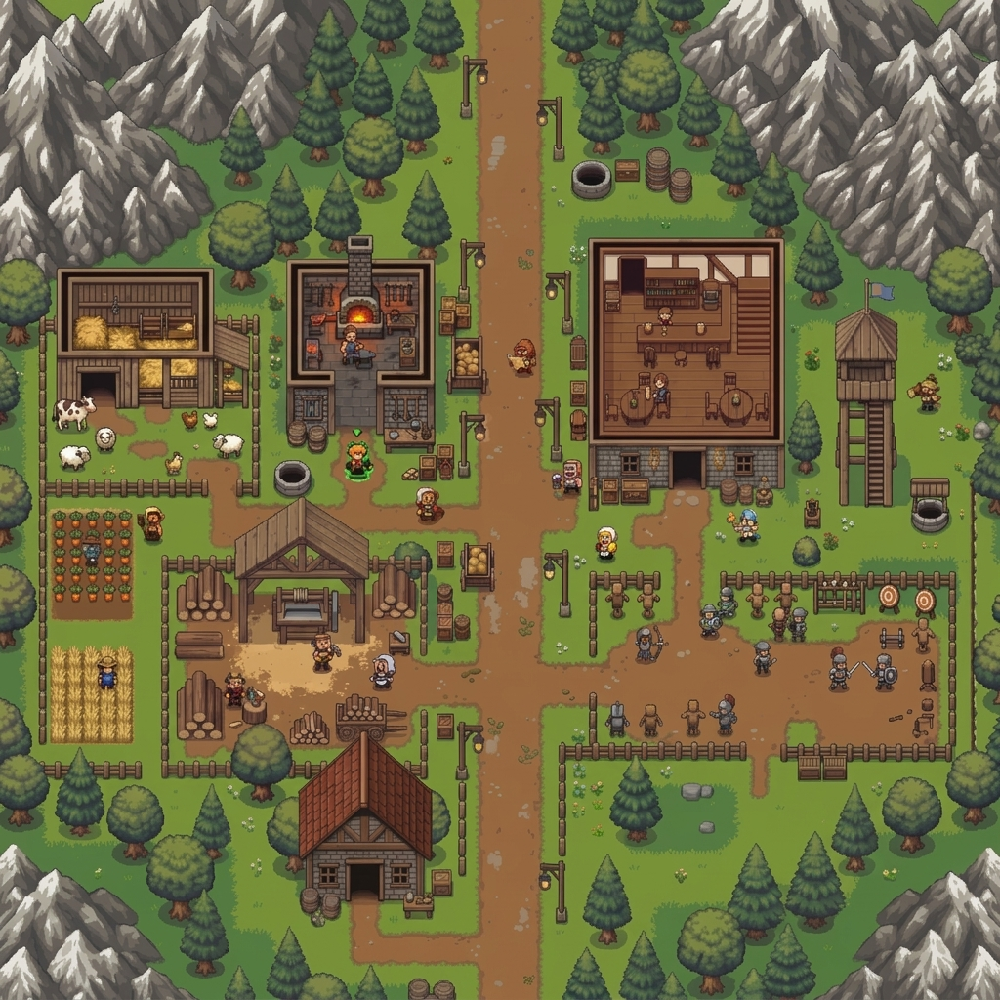

# 🏰 Crownstone: Kingdom Defender

A 16-bit cozy kingdom survival and defense RPG built for modern web browsers.



## 🎮 Features

- **Cozy 16-Bit Pixel Art Aesthetic**: Authentic retro fantasy art style inspired by *Crownstone Survival*, *Minish Cap*, and *Stardew Valley*.
- **Building Cutaway Interior System**: Cutaway views of the Tavern (with bedroom loft and tavern hall) and Blacksmith Forge (with chimney oven and anvil).
- **Settlement Zones**:
  - Cutaway wooden barn with pasture animals (dairy cows, sheep, chickens) and stone well.
  - Farmlands with carrot and wheat crops, plus a straw scarecrow.
  - Lumber sawmill with circular saw and stacked timber logs.
  - Military training grounds with watchtower, archery bullseye targets, training dummies, and sparring militia.
  - Residential stone cottage with red clay-tiled roof and chimney.
  - Pine and round oak forests bordered by snow-capped mountain cliff peaks.
- **Moveable Hero**: Direct WASD / Arrow keys 8-directional movement with smooth animation, tool swinging, and circular green selection reticle.
- **Diegetic Medieval UI**:
  - Top resource bar (Gold, Wood, Stone, Food, Population, Calendar).
  - Current Quest tracker & Objectives progress bars.
  - Real-time minimap with golden star player tracking.
  - 6-button bottom action bar (Build, Villagers, Quests, Trade, Settings, World Map).
- **Built-in 16-Bit Web Audio Synthesizer**: Procedural sound effects for chops, slashes, mining, building hammers, war horns, victory trumpets, and chiptune melodies. Zero external sound files needed.

## 🚀 Getting Started

Zero dependencies required. Runs natively in any modern web browser.

### Run Locally

Using Node.js:
```bash
node server.js
```
Or using Python:
```bash
python3 -m http.server 3000
```

Then open [http://localhost:3000](http://localhost:3000) in your browser.

## 🕹️ Controls

- **Movement**: `W`, `A`, `S`, `D` or `Arrow Keys`
- **Chop / Attack / Action**: `Left-Click` or `Space`
- **Build Menu**: `B` key or click **Build**
- **Villager Roster**: `V` key or click **Villagers**
- **Quest Log**: `Q` key or click **Quests**
- **Camera Zoom**: Click `+` or `-` in Settings

## 📜 License

MIT License.
